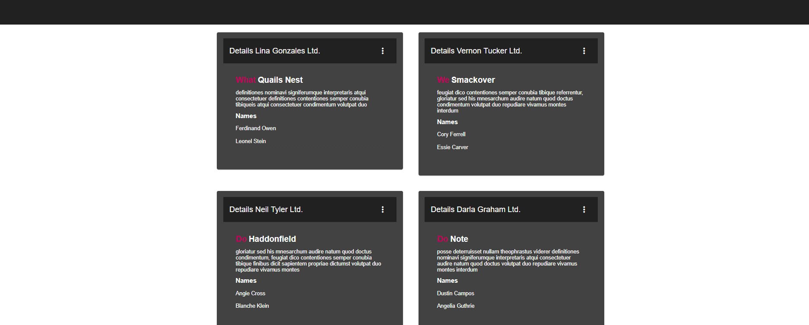

# Angular Card List



Example of using Angular Material Cards in a list. Build with Angular Material and some custom CSS

https://material.angular.io

The example is a row-based card list with 2 columns. It’s a common UI pattern.

```html
 <div class="container" fxLayout="column" fxLayoutGap="10px">
        <div fxLayout="row wrap">
            <div *ngFor="let item of items"
                 fxFlex="50"
                 fxLayout="column"
                 class="p-1">
                <mat-card>
                   ...
                </mat-card>
            </div>
        </div>
    </div>
```
